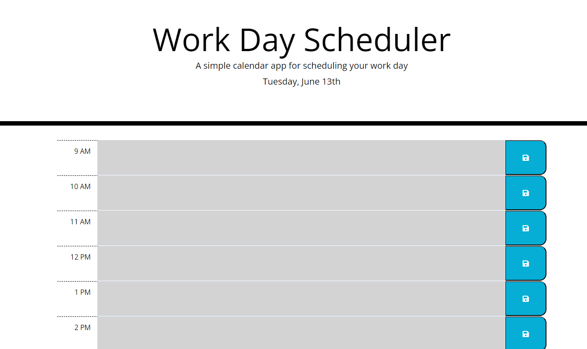
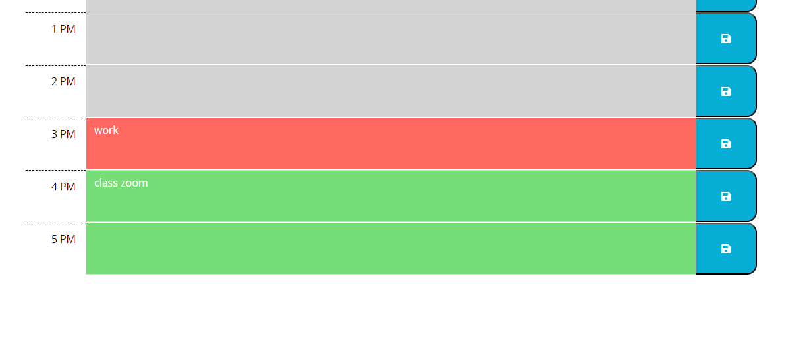

# work-day-scheduler

  <a href="https://yasminetsu.github.io/work-day-scheduler/">
  


## User Story
AS AN employee with a busy schedule
I WANT to add important events to a daily planner
SO THAT I can manage my time effectively

## Acceptance Criteria
GIVEN I am using a daily planner to create a schedule
WHEN I open the planner
THEN the current day is displayed at the top of the calendar
WHEN I scroll down
THEN I am presented with time blocks for standard business hours of 9am to 5pm
WHEN I view the time blocks for that day
THEN each time block is color-coded to indicate whether it is in the past, present, or future
WHEN I click into a time block
THEN I can enter an event
WHEN I click the save button for that time block
THEN the text for that event is saved in local storage
WHEN I refresh the page
THEN the saved events persist

## Technologies

Project was created with:
* CSS
* HTML
* JavaScript


## Installation

To run this project, pull it from Github to your local machine using your terminal.
   
#### Steps: 

1. Open Github
2. Navigate to the 'yasminetsu/work-day-scheduler" repository. 
3. Click the green button on the page that says "code."
4. Copy the link under SSH. 
5. Open your terminal and type the following keys.

```
$ cd <any folder you want this repository to go to>
$ git clone <paste the copied link>
```

 

